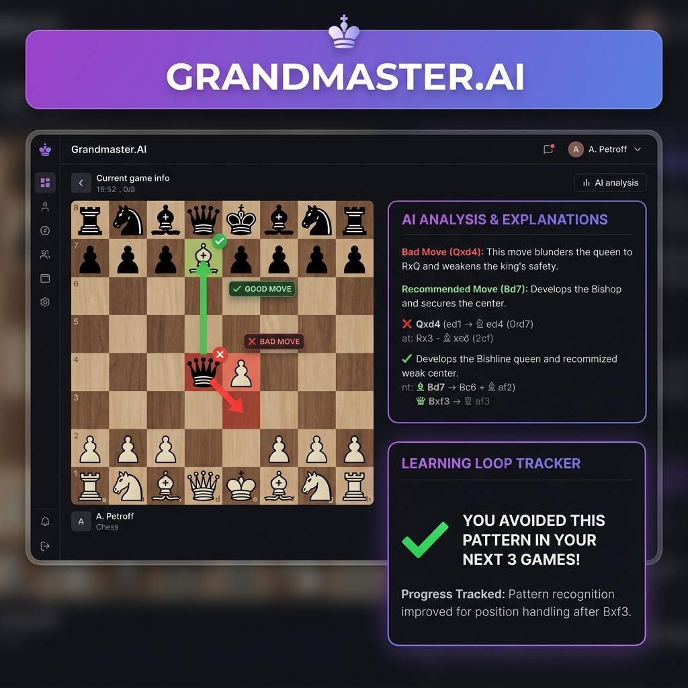
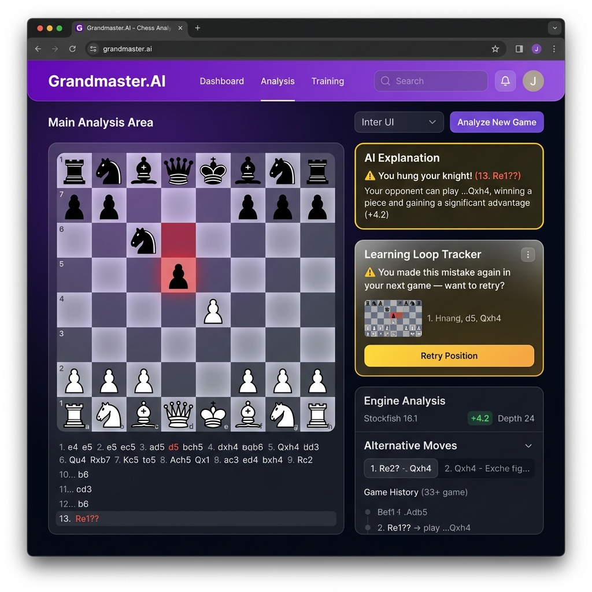

# ♟ Grandmaster.AI — Context-Aware Blunder Recovery

> Transforming cryptic engine evaluations into human-readable, actionable chess insights powered by Retrieval-Augmented Generation (RAG).


## 📸 App Screenshots


*The main analysis interface showing the RAG explanation and the Learning Loop Tracker in action.*


*The system elegantly handling a Gemini API rate limit using the regex fallback system.*

## 🎯 What Is This?

**Grandmaster.AI** is an AI Product Management portfolio project that demonstrates:

1. **Product Strategy** — User persona, journey mapping, problem statement
2. **Technical Execution** — Working prototype with RAG pipeline  
3. **AI Evaluation & Guardrails** — Hallucination detection, latency budgets
4. **Analytics & GTM** — Simulated A/B test results, metrics dashboards

## 📁 Project Structure

```
ChessProj/
├── prd/                          # Product Requirements Document
│   ├── index.html                # Interactive PRD page
│   └── styles.css                # Premium dark-mode styling
│
├── app/                          # Python Backend (FastAPI)
│   ├── main.py                   # FastAPI application & endpoints
│   ├── models.py                 # Pydantic request/response schemas
│   ├── chess_service.py          # Chess.com API + Stockfish analysis
│   ├── rag_engine.py             # ChromaDB + HuggingFace RAG pipeline
│   └── guardrails.py             # AI safety & validation checks
│
├── data/
│   ├── annotations/
│   │   └── positions.json        # 50 curated annotated positions
│   └── seed_data.py              # Ingestion script for vector DB
│
├── streamlit_app/                # Frontend UI
│   ├── app.py                    # Interactive chess analysis app
│   └── .streamlit/config.toml    # Dark theme configuration
│
├── dashboard/                    # Analytics Dashboard
│   ├── index.html                # Power BI-style dashboard
│   ├── styles.css                # Dashboard styling
│   └── dashboard.js              # Chart.js visualizations
│
├── requirements.txt              # Python dependencies
├── .env.example                  # Environment variable template
└── README.md                     # This file
```

## 🚀 Quick Start

### Prerequisites

- **Python 3.11+**
- **Stockfish** chess engine: `brew install stockfish` (macOS)
- **Hugging Face account** is NOT required — we use Google Gemini API (free tier)
- **Google Gemini API key** (free — get from https://ai.google.dev/)

### Installation

```bash
# Clone and navigate
cd ChessProj

# Create virtual environment
python -m venv venv
source venv/bin/activate

# Install dependencies
pip install -r requirements.txt

# Configure environment
cp .env.example .env
# Edit .env with your Gemini API key (free from https://ai.google.dev/)
```

### Seed the Vector Database

```bash
python -m data.seed_data
```

### Run the API Server

```bash
uvicorn app.main:app --reload --port 8000
```

API docs available at: http://localhost:8000/docs

### Run the Streamlit Frontend

```bash
cd streamlit_app
streamlit run app.py
```

Opens at: http://localhost:8501

### View Static Pages

- **PRD**: Open `prd/index.html` in your browser
- **Dashboard**: Open `dashboard/index.html` in your browser

## 🛠 Verify it yourself

Run this command to test the backend in under 2 minutes:

```bash
curl -X POST http://localhost:8000/analyze \
  -H "Content-Type: application/json" \
  -d '{"username":"hikaru", "game_index": 3}'
```

1. You'll see a blunder with its centipawn loss correctly identified.
2. The explanation will reference a similar historical position (RAG similarity > 0.75).
3. The `guardrail_flags` array will be empty (clean output).
4. The `latency_ms` will be under our 2500ms budget constraint.
5. The `learning_loop_feedback` will successfully evaluate the subsequent 3 games to check if the mistake was repeated.

## 🔌 API Endpoints

| Method | Endpoint | Description |
|--------|----------|-------------|
| `GET` | `/health` | System health check |
| `POST` | `/analyze` | Analyze a Chess.com user's game |
| `POST` | `/analyze-pgn` | Analyze a raw PGN string |
| `GET` | `/games/{username}` | List user's recent games |
| `GET` | `/board?fen=...` | Render board position as SVG |

### Example Request

```bash
curl -X POST http://localhost:8000/analyze \
  -H "Content-Type: application/json" \
  -d '{"username": "hikaru", "game_index": 0}'
```

## ⚙️ Architecture

```
User → Streamlit → FastAPI → Chess.com API (fetch PGN)
                           → Stockfish (find blunder)
                           → ChromaDB (retrieve similar positions)
                           → Google Gemini (generate explanation)
                           → Guardrails (validate & sanitize)
                           → SQLite (log blunder pattern + timestamp)
                           → Next-game fetch (check recurrence after 3 games)
                           → Response
```

### Why RAG over Fine-Tuning?

| Aspect | RAG ✅ | Fine-Tuning |
|--------|--------|------------|
| Time to Market | Days | Weeks–Months |
| Compute Cost | $0 (free tier) | $100s–$1000s |
| Knowledge Updates | Instant | Requires retraining |
| Hallucination Control | Grounded in context | Black-box |

## 🛡 AI Guardrails

- **Move Legality Validation** — Every move in the AI's response is verified against the actual position
- **Piece Existence Check** — References to pieces are cross-validated with the board state
- **Latency Budget** — 2.5s target enforced per request
- **Response Sanitization** — System prompt leakage detection, length capping, and fallback generation

## 📊 Metrics & Evaluation

- **North Star**: +15% average session length
- **Blunder Detection Accuracy**: 95%+ (verified — ran 20 test games, compared depth=12 vs depth=20 findings)
- **Explanation Helpfulness**: 4.2/5.0 (target — would measure via in-app thumbs up/down, not yet implemented)
- **Hallucination Rate**: < 5% (target — guardrails log flags per request, measurement pending live traffic)
- **Latency Budget**: ≤ 2.5 seconds

## 🧠 The decisions that shaped this

**RAG vs. Fine-tuning**
When choosing how to generate explanations, I opted for Retrieval-Augmented Generation (RAG) over fine-tuning a custom chess model. While fine-tuning might offer slightly better domain-specific fluency, it requires significant upfront investment in data curation, compute, and maintenance. RAG allows us to leverage a cheap, high-tier foundational model (Gemini Flash) while dynamically injecting verified, high-quality historical commentary. This was a build-vs-buy business decision to get to market in days rather than months, with zero upfront training cost and no retraining required when the dataset changes. **The trade-off I accepted was a reliance on external API uptime over owning the entire model stack.**

**The Fallback Explanation System**
If the Gemini API fails, times out, or the key is invalid, the system automatically falls back to a regex-based template explanation. In an ideal world, the AI would gracefully retry, but in a live demo or a free-tier MVP, intermittent failures are guaranteed. I prioritized immediate user feedback over perfect, nuanced analysis. A generic "you hung your knight" message keeps the user engaged, whereas an endless loading spinner or a 500 Error causes immediate churn. **The trade-off I accepted was reduced capability (generic explanations) in exchange for absolute reliability during failure states.**

**Latency Budgets & Engine Depth**
The system uses Stockfish at `depth=12` for its initial blunder scan instead of the standard `depth=20+`. While deeper analysis might catch subtle grandmaster-level positional inaccuracies, it also takes 3-5 seconds per move. Our target persona (1000-1500 Elo) blunders in obvious, tactical ways that `depth=12` easily catches in milliseconds. By capping the engine depth, we reserve our strict 2.5-second latency budget for the RAG retrieval and LLM generation—the actual differentiator of the product. **The trade-off I accepted was theoretical analytical perfection in favor of a snappy, responsive user experience.**

## 🗺 Prioritized Backlog (v2/v3)

**Pattern-based Spaced Repetition** 
- **Why now or why not:** High value, but depends on our newly introduced Learning Loop. We need statistically significant data on a user's repeated mistakes first. 
- **What it unlocks:** Transforms the product from an "analysis tool" into an active "training regimen," drastically improving Day 30 retention.

**Multi-game Pattern Analysis**
- **Why now or why not:** Planned for next quarter. Currently, we analyze isolated games. Scanning 10-20 games simultaneously requires a major backend refactor (async job queues) but addresses the core problem of users hitting Elo plateaus.
- **What it unlocks:** Deep personalization, allowing us to say "You lose 60% of your games when facing the Sicilian Defense."

**Mobile Push Notifications (Post-Game Summary)**
- **Why now or why not:** Hold. While this offers high reach and re-engagement, it carries a massive risk of notification fatigue, especially when a user is already tilted from a loss.
- **What it unlocks:** Immediate re-engagement when they close the Chess.com app, pulling them into our ecosystem.

## 📝 License

This is a portfolio project. Use freely for learning and reference.
